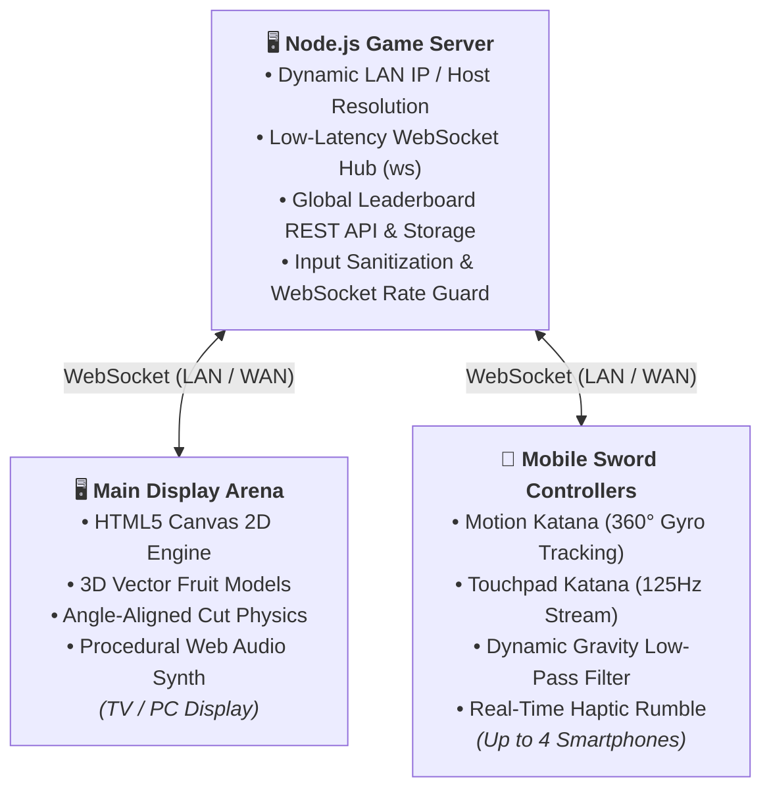

<div align="center">

# ⚔️ DOJO BLADE: DEVIL FRUITS

### *Next-Gen Real-Time Multiplayer Fruit Slicing Game Powered by Smartphone Sword Controllers*

[](https://nodejs.org)
[](https://github.com/websockets/ws)
[](https://developer.mozilla.org/en-US/docs/Web/API/Canvas_API)
[](https://www.w3.org/TR/orientation-event/)
[](https://devil-fruit-multiplayer.onrender.com)
[](https://opensource.org/licenses/MIT)

<p align="center">
  <b>Turn your smartphone into a high-precision physical katana.</b><br>
  Scan the on-screen QR code from any mobile browser, swing your phone in the air or swipe across the glass, and slash Devil Fruits in real time on your laptop, monitor, or TV screen!
</p>

<p align="center">
  🎮 <b>Live Arena:</b> <a href="https://devil-fruit-multiplayer.onrender.com">https://devil-fruit-multiplayer.onrender.com</a><br>
  📱 <b>Controller:</b> <a href="https://devil-fruit-multiplayer.onrender.com/controller.html">https://devil-fruit-multiplayer.onrender.com/controller.html</a>
</p>

</div>

---

## 🌟 Highlights & Key Features

### 🗡️ Dual Controller Modes
Switch seamlessly on the phone controller interface between two play styles:
1. **Motion Katana (Physical Air Swings)**:
   - **1:1 Omnidirectional Tracking**: Real-time 360° continuous angle calculation ($\theta = \text{atan2}(V_y, V_x)$)—horizontal chops, vertical downward executions, rising diagonal cuts, and reverse slashes are mapped with zero angle snapping.
   - **4-Sample Kinetic Momentum Buffer**: Eliminates pre-swing wrist twitch and noise by weighting directional vectors by instantaneous kinetic energy across a ~50ms window ($w_i = \text{netMag}_i^2 + (\omega_{\text{gyro}} \times 0.05)^2$).
   - **Calibrated Portrait Gyroscope Projection**: Corrects W3C DeviceMotionEvent yaw mapping for natural portrait-oriented swings ($\omega_{\text{yaw}} = \omega_\gamma \sin\beta + \omega_\alpha \cos\beta$).
   - **Dynamic Gravity Isolation**: Dynamic component low-pass filtering isolates Earth's $9.8\,\text{m/s}^2$ gravity field from linear acceleration on all hardware.
   - **180ms Combo Cooldown**: Enables rapid double and triple martial-arts combos.
   - **Silent Phone Speaker**: Mobile device stays completely silent while delivering crisp haptic rumble; all cinematic slash audio plays through the main display.
   - **Sensitivity Toggle**: Switch between `NORMAL` ($11\,\text{m/s}^2$) and `HIGH` ($8.5\,\text{m/s}^2$).
2. **Touchpad Katana (Glass Swiping)**:
   - Ultra-responsive touch-surface streaming at ~125 updates/second with sub-pixel trajectory interpolation (`STEP_SIZE = 8px`), guaranteeing high-velocity finger swipes never pass through fruits undetected.

---

### 🍇 Devil Fruits & Anime Lore
Slice standard fruits alongside legendary Devil Fruits featuring animated glowing swirls and round-altering combat buffs:
- **Gomu Gomu no Mi (Rubber Fruit)**: Unlocks *Rubber Frenzy*—dramatically slows down time and launches a barrage of bouncy bonus fruits.
- **Mera Mera no Mi (Flame Fruit)**: Unleashes a screen-clearing *Fiery Inferno* blast that vaporizes all active fruits for massive combo points.
- **Ope Ope no Mi (Op-Op Fruit)**: Deploys Trafalgar Law's *Spatial Room*, freezing airborne fruits in zero-gravity for precision multi-slashes.
- **Standard Fruits**: Watermelon, Pineapple, Orange, Lemon, Strawberry, plus Hazard Bombs!

---

### 📐 Angle-Aligned Slicing Physics
- **Perpendicular Separation Impulse**: Halves of sliced fruit separate along the exact perpendicular normal of the cut trajectory:
  $$\vec{n} = (-\sin\theta_{\text{cut}}, \cos\theta_{\text{cut}})$$
  - Horizontal cuts fly vertically apart (top upward, bottom downward).
  - Vertical chops burst outward horizontally.
  - Diagonal cuts split along the exact diagonal plane.
- **Rotated Cut-Plane Geometry**: Canvas 2D clipping masks dynamically orient along the blade angle so seeds, rinds, and inner pulp face the slice plane.

---

### 🏆 Persistent Global Leaderboard & International Slayers
- **Cross-Session High Scores**: Backed by a persistent JSON database (`leaderboard.json`) with top 10 rankings per game mode.
- **Country Flags & Custom Nicknames**: 20+ country flags with ISO codes (`🇮🇳 India`, `🇺🇸 USA`, `🇯🇵 Japan`, `🇬🇧 UK`, `🇩🇪 Germany`, `🇧🇷 Brazil`, etc.).
- **New Record Celebration**: Game-over celebratory fanfare for new global top 10 and #1 high-score records.

---

### 👥 4-Player Local & Remote Multiplayer
- Supports up to 4 simultaneous slayers on a single screen.
- Unique neon visual identities: **Neon Pink**, **Neon Green**, **Neon Blue**, and **Neon Yellow**.
- Distinct glowing blade trails, real-time synchronized scoreboard, and combo multipliers ($3\times$, $4\times$, $5\times$).

---

### 🔊 Procedural Web Audio Engine (Zero Assets)
- 100% mathematical sound synthesis via the Web Audio API—**zero external MP3/WAV downloads**:
  - Sub-bass blade whooshes and sharp metal cutting sweeps
  - Juicy fruit squelch and seed crunch noise bursts
  - Explosive low-pass bomb detonations and fuse hisses
  - Ambient Japanese pentatonic scale background chords
  - High-score victory fanfares

---

## 🎮 Game Modes

| Mode | Rules & Objectives |
| :--- | :--- |
| **⚔️ Classic Mode** | 3 Lives. Dropping whole fruits costs 1 life. Slicing a hazard bomb ends the game immediately. Pure reflex challenge. |
| **🧘 Zen Mode** | 90-Second timer. No falling fruit penalties. Bomb strikes deduct 10 points instead of ending the game. High-scoring frenzy. |

---

## 🏗️ System Architecture



---

## ⚡ Quickstart & Local Setup

### 1. Clone the repository
```bash
git clone https://github.com/27aryankhan/devil-fruit-multiplayer.git
cd devil-fruit-multiplayer
```

### 2. Install dependencies
```bash
npm install
```

### 3. Start the server
```bash
npm start
```

### 4. Connect & Play
1. Open **`http://localhost:3000`** in your computer or TV browser.
2. Connect your mobile phone to the same Wi-Fi network.
3. Scan the on-screen QR code with your phone camera (or navigate to the displayed network IP address, e.g. `http://192.168.1.X:3000/controller.html`).
4. Select your **Slayer Name**, choose your **Country Flag**, choose your preferred controller mode (**Motion Katana** or **Touchpad**), and tap **Sync Sword**!

---

## 🕹️ Controller Modes & Calibration

### Motion Katana Guide
- **Holding the Phone**: Hold the phone upright in portrait mode facing forward like a sword hilt.
- **Swinging**: Swing your hand cleanly through the air (horizontal sweep, downward chop, or angled slash).
- **Visual Feedback**: The on-screen katana blade on your phone rotates to match your physical swing angle in real time and displays your strike angle and directional arrow (e.g. `Down-Right Slash 42° ↘`).
- **Sensitivity**: Tap the **Sensitivity** button in the top HUD to toggle between `NORMAL` (for energetic room swings) and `HIGH` (for subtle wrist flicks).

### Touchpad Katana Guide
- Drag your finger across the full-screen touchpad.
- Swipe velocity controls blade trail glow, thickness, and combo reach.

---

## 📁 Project Directory Structure

```text
devil-fruit-multiplayer/
├── public/
│   ├── index.html             # Main desktop/TV arena, lobby HUD & modal displays
│   ├── controller.html        # Mobile controller interface with Motion & Touch UI
│   ├── css/
│   │   ├── style.css          # Desktop arena glassmorphism styling & animations
│   │   └── controller.css     # Mobile sword HUD, gauge & responsiveness
│   └── js/
│       ├── game.js            # Canvas 2D engine, fruit physics & angle slicing
│       ├── controller.js      # Sensor fusion, 4-sample ring buffer & touch pipeline
│       ├── audio.js           # Procedural Web Audio API sound synthesizer
│       └── qrious.min.js      # Client-side QR code generator
├── server.js                  # Node.js HTTP server, WebSocket hub & leaderboard API
├── leaderboard.json           # Persistent global high score records
├── package.json               # Project manifest and scripts
├── .gitignore                 # Exclusion rules for secrets, logs, and OS caches
└── README.md                  # Comprehensive project documentation
```

---

## 📡 REST & WebSocket Protocol

### REST Endpoints
- **`GET /api/system-ip`**: Returns host machine IP addresses for seamless LAN pairing.
- **`GET /api/leaderboard?mode=classic`**: Retrieves top 10 scores for the requested game mode.
- **`POST /api/leaderboard/submit`**: Submits match results with player name, score, max combo, mode, and country.

### WebSocket Events
- **Client $\to$ Server**:
  - `register`: `{ name, color, country, mode }`
  - `touchStart` / `touchMove` / `touchEnd`: Normalized $(x, y)$ coordinates ($0.0$ to $1.0$).
  - `motionSlash`: Vector endpoints `{ from: {x, y}, to: {x, y}, angle, speed, direction }`.
  - `changeMode`: Host updates game mode (`classic` / `zen`).
  - `startGame` / `restartGame` / `returnToLobby`.
- **Server $\to$ Client**:
  - `init`: Assigned player ID, color slot, and current game state.
  - `playerJoined` / `playerLeft`: Multi-client lobby synchronization.
  - `gameState`: Synced state transitions (`LOBBY`, `PLAYING`, `GAMEOVER`).

---

## 🛡️ Security & Performance

- **Rate Limiting**: Per-socket token bucket throttles up to 500 packets/second to support high-refresh-rate displays (120Hz/90Hz) while protecting against socket flooding.
- **Payload Sanitization**: Strict 4KB payload limits and sanitization against HTML/script injection in player names and scores.
- **Content Security Policy**: Hardened headers preventing unauthorized script execution, iframe embedding, and cross-site scripting.
- **WakeLock API**: Prevents mobile screens from dimming or locking mid-match.

---

## 🌐 Deployment

This project requires zero external database dependencies and can be deployed with one click:

### Deploying to Render
1. Fork or push this repository to GitHub.
2. Sign in to [Render.com](https://render.com) and click **New > Web Service**.
3. Connect your repository.
4. Set:
   - **Environment**: `Node`
   - **Build Command**: `npm install`
   - **Start Command**: `npm start`
5. Render automatically provides an HTTPS/WSS URL with WebSocket support.

---

## 📜 License

This project is licensed under the [MIT License](LICENSE).
